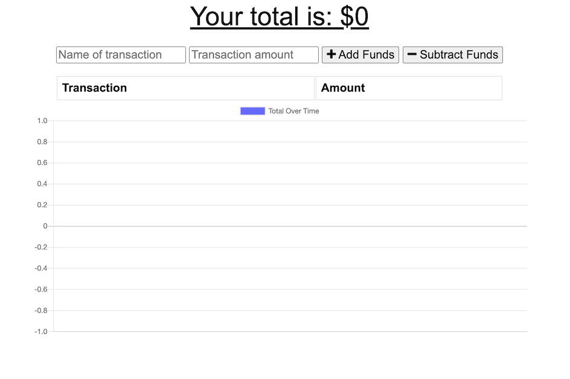
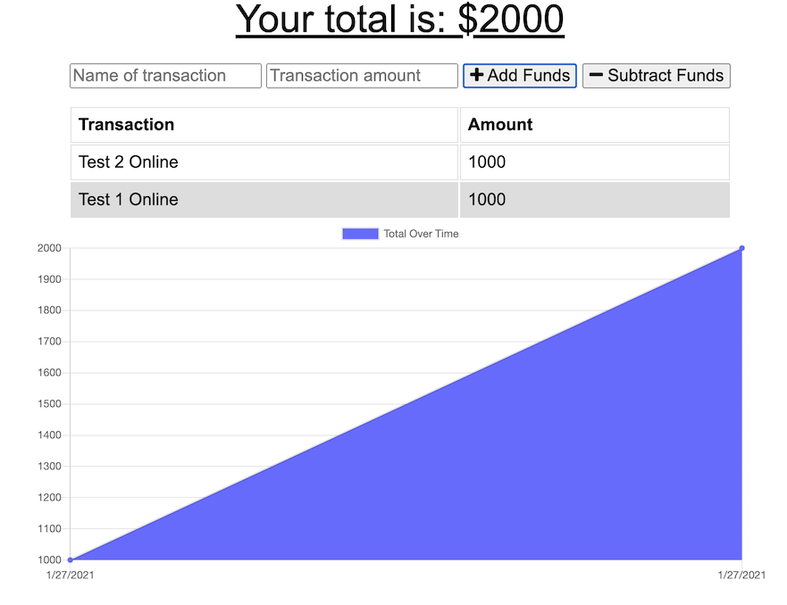

# Budget.Tracker

[](https://opensource.org/licenses/MIT)
      
     
## Description

Budget Tracker with added functionality to allow for offline access. 

## Table of Contents
 
* [Installation](#installation)
* [Usage](#usage)
* [Credits](#credits)
* [License](#license)
 
## Installation
https://budgetracker1234.herokuapp.com/


## Usage
Access the Budget Tracker repo [here.](https://github.com/lee-amber-alex/BudgetTracker) 
  

##### Home Page 


##### Enter amounts and description.  
 

#####  Application still working offline.  
  

#####  Back online after refreshing the page.  


## License
This project is covered under the MIT License.

## License
This project is covered under the MIT License.
 


## Tests
```
npm test
``` 

## Questions
- [Email](lee.amber.alex@gmail.com)
- [Github Page](https://github.com/lee-amber-alex)
 
